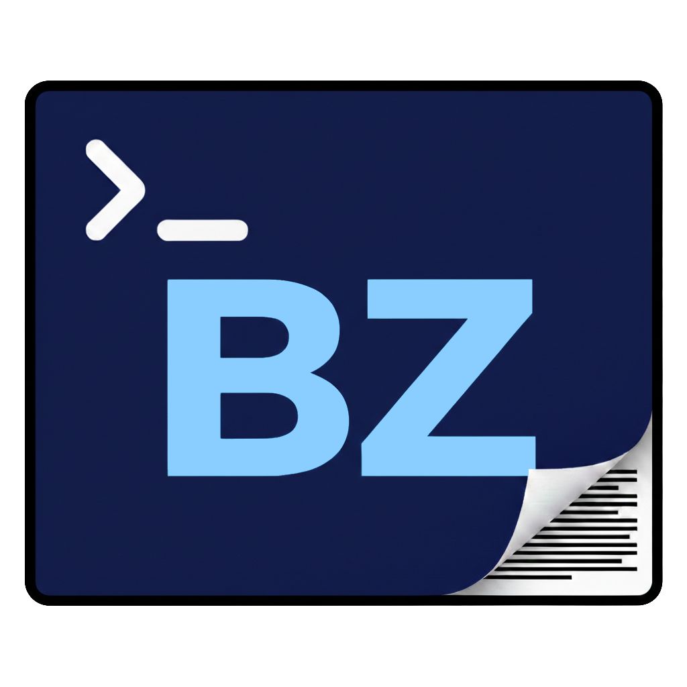

<!-- Improved README.md generation -->
<br />
<div align="center">
  <table>
    <tr>
      <td valign="middle" style="padding-right:10px">
        <a href="https://github.com/BZ-Interactive/BZ-Nota">
          
        </a>
      </td>
      <td valign="middle" style="text-align:left; max-width:720px">
        <h3 style="margin:0">BZ-Nota</h3>
        <p style="margin-top:8px; margin-bottom:8px; text-align:left">
          A high-performance, terminal-based text editor built on C++. It combines the intuitive editing of Micro with a modern, btop-style dashboard interface for a modern TUI experience.
        </p>
        <p style="margin:0; text-align:left">
          <a href="https://github.com/BZ-Interactive/BZ-Nota"><strong>Explore the docs »</strong></a>
          &nbsp;&nbsp;|&nbsp;&nbsp;
          <a href="https://github.com/BZ-Interactive/BZ-Nota/releases">See Releases</a>
          &nbsp;·&nbsp;
          <a href="https://github.com/BZ-Interactive/BZ-Nota/issues">Request Feature</a>
          &nbsp;·&nbsp;
          <a href="https://github.com/BZ-Interactive/BZ-Nota/issues">Report Bug</a>
        </p>
      </td>
    </tr>
  </table>
</div>

<div align="center">

[![CPP][CPP-shield]][CPP-url]


</div>

<!-- TABLE OF CONTENTS -->
<details>
  <summary>Table of Contents</summary>
  <ol>
    <li>
      <a href="#🧐-about-the-project">About The Project</a>
      <ul>
        <li><a href="#built-with">Built With</a></li>
      </ul>
    </li>
    <li>
      <a href="#🚀-getting-started">Getting Started</a>
      <ul>
        <li><a href="#prerequisites">Prerequisites</a></li>
        <li><a href="#installation">Installation</a></li>
      </ul>
    </li>
    <li>
      <a href="#✍️-usage">Usage</a>
      <ul>
        <li><a href="#basic-usage">Basic Usage</a></li>
        <li><a href="#command-line-options">Command-Line Options</a></li>
        <li><a href="#keybindings">Keybindings</a></li>
        <li><a href="#system-clipboard">System Clipboard</a></li>
      </ul>
    </li>
    <li><a href="#🖥️-tested-terminals">Tested Terminals</a></li>
    <li><a href="#📅-planned-features">Planned features</a></li>
    <li><a href="#🤝-contributing">Contributing</a></li>
    <li><a href="#📝-license">License</a></li>
    <li><a href="#📧-contact">Contact</a></li>
    <li><a href="#🙏-acknowledgments">Acknowledgments</a></li>
  </ol>
</details>

<!-- ABOUT THE PROJECT -->
## 🧐 About The Project

BZ-Nota is a terminal-based text editor that aims to provide a modern and efficient editing experience in the terminal. It's designed for developers and power users who want the simplicity and keybindings of editors like Micro, combined with a powerful, integrated dashboard, inspired by `btop`.

Key Features:
*   **Intuitive Editing**: Familiar keybindings and a focus on simplicity.
*   **Modern TUI**: A dashboard for file navigation, project statistics, and more.
*   **High Performance**: Built with C++ for speed and low resource usage.
*   **Minimal Resource Usage**: Uses less than 2MB and close to zero CPU when editing an empty file.

<p align="right">(<a href="#readme-top">back to top</a>)</p>

### Built With

*   [![CPP][CPP-shield]][CPP-url]
*   [![ftxui][ftxui-shield]][ftxui-url]

<p align="right">(<a href="#readme-top">back to top</a>)</p>

<!-- GETTING STARTED -->
## 🚀 Getting Started

To get a local copy up and running, follow these simple steps.

### Prerequisites

You'll need a modern C++ compiler and CMake to build BZ-Nota. Installing the standard build tools is sufficient for most builds.

**Note:** Pre-packaged versions will be available upon reaching version 1.0.

*   **C++ Compiler**: Recommended — install `build-essential` (includes `g++`, `gcc`, and `make`)
*   **Alternative compilers**: Clang or MSVC are also supported
*   **CMake**: Version 3.10 or higher

**System Clipboard Support:**

*   **Linux (X11)**: `xclip` or `xsel`
*   **Linux (Wayland)**: `wl-clipboard`
*   **macOS**: Built-in clipboard commands (no installation needed) — Not tested yet
*   **Windows**: Built-in clipboard commands (`clip` for copy, PowerShell's `Get-Clipboard` for paste) — Not tested yet

Example (Debian/Ubuntu):

```sh
sudo apt-get update
sudo apt-get install build-essential cmake
```

For other platforms, use the equivalent package manager (e.g., `brew`, `pacman`, etc.).

### Installation

1.  Clone the repo
    ```sh
    git clone https://github.com/BZ-Interactive/BZ-Nota.git
    ```
2.  Create a build directory
    ```sh
    cd BZ-Nota
    mkdir build && cd build
    ```
3.  Configure and build the project
    ```sh
    cmake ..
    make
    ```
4.  (Optional) Install to your system
    ```sh
    sudo make install
    ```
    This will install the `bznota` executable to your system's binary directory (typically `/usr/local/bin`), making it available system-wide.

5.  Run the editor
    ```sh
    # If installed
    bznota
    
    # Or run directly from build directory
    ./bznota
    ```

<p align="right">(<a href="#readme-top">back to top</a>)</p>

<!-- USAGE EXAMPLES -->
## ✍️ Usage

### Basic Usage

To launch the editor, run the executable with a file path:

```sh
./bznota <filename>
```

### Command-Line Options

```sh
./bznota [-d] [-v] <filename>
```

**Options:**

*   `-h`, `--help` — Show usage and option explanations
*   `-d`, `--debug` — Enable debug mode (displays key sequence information in the status bar)
*   `-v`, `--version` — Display version information and exit

**Examples:**

```sh
# Open a file for editing
./bznota example.txt

# Display version information
./bznota -v

# Open with debug mode enabled
./bznota -d example.txt

# Debug mode can be placed anywhere
./bznota --debug myfile.cpp
```

### Keybindings

**File Operations:**
*   `Ctrl+S` — Save file
*   `Ctrl+Q` — Quit (prompts if unsaved changes)

**Editing:**
*   `Ctrl+A` — Select All
*   `Ctrl+C` — Copy to system clipboard
*   `Ctrl+X` — Cut to system clipboard
*   `Ctrl+V` — Paste from system clipboard
*   `Ctrl+Insert` / `Shift+Insert` — Traditional clipboard shortcuts (alternative)
*   `Ctrl+Shift+C` / `Ctrl+Shift+V` — Modern terminal clipboard (Alacritty, WezTerm)
*   `Ctrl+Z` — Undo
*   `Ctrl+Y` — Redo
*   `Tab` — Insert tab
*   `Shift+Tab` — Remove leading tab (unindent)

**Formatting**

*   `Ctrl+B` — Bold
*   `Ctrl+I` — Italic
*   `Ctrl+U` — Underline
*   `Ctrl+T` — Strikethrough

All work on selection, can use this to write formatted or apply any format to a pre-written text.

All can be applied on top of each other.


**Navigation:**
*   `Arrow Keys` — Move cursor
*   `Shift+Arrow` — Select text while moving
*   `Ctrl+Arrow` — Jump by word
*   `Ctrl+Shift+Arrow` — Select by word (Alacritty)
*   `Alt+Shift+Arrow` — Select by word (alternative)
*   `Home` — Jump to start of line (smart: toggles between first non-whitespace and column 0)
*   `End` — Jump to end of line

**Line Operations:**
*   `Ctrl+O` — Insert blank line above
*   `Ctrl+K` — Insert blank line below

**Note:** Some keybindings may be intercepted by your terminal emulator. For best results, use Alacritty or disable conflicting terminal shortcuts.

**System Clipboard:** The system clipboard feature requires external tools (`xclip`/`xsel` for X11, `wl-clipboard` for Wayland, built-in on macOS). See [CLIPBOARD.md](CLIPBOARD.md) for detailed setup instructions.

_For more examples, please refer to the [Documentation](https://github.com/BZ-Interactive/BZ-Nota)_

<p align="right">(<a href="#readme-top">back to top</a>)</p>

## 🖥️ Tested Terminals

Below are terminals that are tested and their known quirks.

Linux:
- alacritty — **Works perfectly**.
- gnome-terminal — `Ctrl+Shift+Arrow` won't work; use `Alt+Shift+Arrow` instead.
- kitty — `Ctrl+Shift+Arrow` won't work; use `Alt+Shift+Arrow` instead.
- XTerm and UXterm — **Works perfectly**, switches to unicode symbols (fixed/courier).

macOS:
- To be tested.

Windows:
- To be tested.

<p align="right">(<a href="#readme-top">back to top</a>)</p>


## 📅 Planned features

These are short-term items planned as next priorities; the editor will focus on core editing and the dashboard first.

- Bullet Point Integration for more complex Text Editing
- Privilege Elevation similar to Micro
- User customization for UI colors
- Limited user customization for controls
- PgUp / PgDn support for navigation
- Search, Find and Replace, including Batch Replace
- Native simple grammar syntax highlighting for common formats (`.yaml`, `.toml`, `.md`, etc.) (via tree-sitter)
- User-added complex grammar syntax highlighting via shared objects (`.so`) for languages like C++, C#, Python, Lua, etc. (via tree-sitter)
- Mouse Support
- Language dictionary and spell checking for 'Text Editing' mode (implementation may change)
<p align="right">(<a href="#readme-top">back to top</a>)</p>

<!-- CONTRIBUTING -->
## 🤝 Contributing

Contributions are welcome! Feel free to:

- Submit feature requests via [Issues](https://github.com/BZ-Interactive/BZ-Nota/issues)
- Report bugs via [Issues](https://github.com/BZ-Interactive/BZ-Nota/issues)
- Create pull requests

<p align="right">(<a href="#readme-top">back to top</a>)</p>

<!-- LICENSE -->
## 📝 License

Distributed under the MIT License. See `LICENSE` for more information.

<p align="right">(<a href="#readme-top">back to top</a>)</p>

<!-- CONTACT -->
## 📧 Contact

[](mailto:barkin.zorlu.bz@gmail.com)

[](https://github.com/ZorluBarkin)
[](https://www.linkedin.com/in/barkin-zorlu)

Project Link: [https://github.com/BZ-Interactive/BZ-Nota](https://github.com/BZ-Interactive/BZ-Nota)

<p align="right">(<a href="#readme-top">back to top</a>)</p>

<!-- ACKNOWLEDGMENTS -->
## 🙏 Acknowledgments

*   [Micro Text Editor](https://github.com/zyedidia/micro)
*   [btop++](https://github.com/aristocratos/btop)
*   [Img Shields](https://shields.io)
*   [Choose an Open Source License](https://choosealicense.com)

<p align="right">(<a href="#readme-top">back to top</a>)</p>

<!-- MARKDOWN LINKS & IMAGES -->
[linkedin-shield]: https://img.shields.io/badge/-LinkedIn-black.svg?style=for-the-badge&logo=linkedin&colorB=555
[linkedin-url]: www.linkedin.com/in/barkin-zorlu
[CPP-shield]: https://img.shields.io/badge/C++-17-blue
[CPP-url]: https://isocpp.org/
[ftxui-shield]: https://img.shields.io/badge/ftxui-UI-blue
[ftxui-url]: https://github.com/ArthurSonzogni/ftxui
<a name="readme-top"></a>
